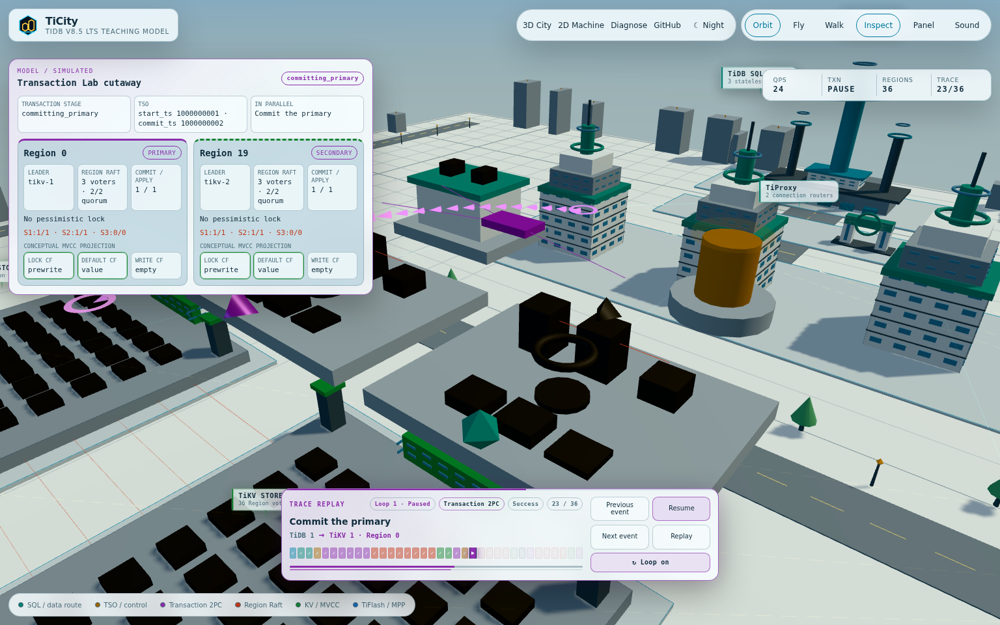
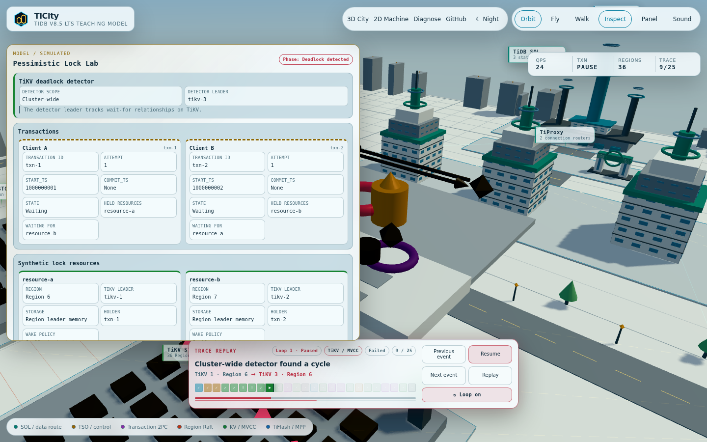
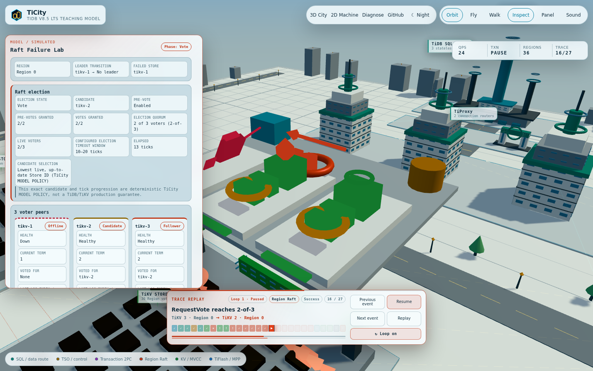
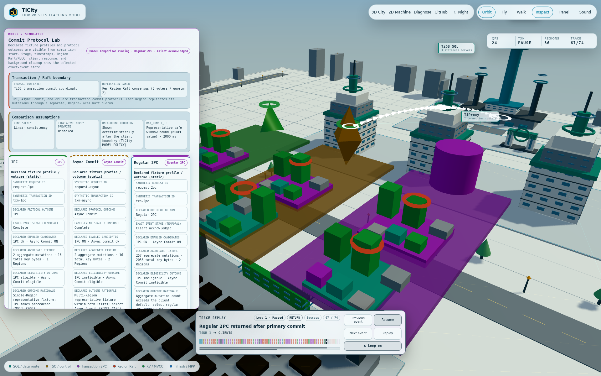
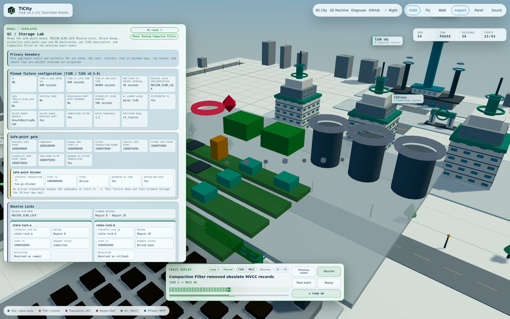

# TiCity

English | [日本語](README.ja.md)

**A deterministic 3D model of TiDB's distributed SQL architecture that you can walk through and inspect.**

TiCity is an independent Apache-2.0 educational project derived from
[PGSimCity](https://github.com/NikolayS/PGSimCity). It is an educational
scale model, not a TiDB emulator, an implementation of TiDB, TiKV, or TiFlash,
or a client connected to a live cluster. It is designed for understanding the
main processing boundaries and execution order. The interface defaults to
Japanese and can be switched to English.

Live site: <https://penguin425.github.io/TiCity/>



> [!IMPORTANT]
> TiCity v0.8.0 is the current published release. It targets the TiDB v8.5 LTS
> line as a static, offline model and includes the model-6 GC/Storage Lab.
> TiCity does not execute SQL or return real data or invented result rows. A
> single SQL statement entered by the user is classified entirely in the
> browser, and only a modeled route and explanation are generated.

## What you can inspect

- A Transaction Lab cutaway for one detailed two-Region pessimistic
  transaction, opened with **Inspect**
- Leader-memory pessimistic locks, parallel prewrite branches, independent
  2-of-3 Raft quorums, apply, and conceptual MVCC `LOCK`, `DEFAULT`, and
  `WRITE` column-family state
- A separate Lock Lab cutaway for two explicit pessimistic transactions and
  two opaque resources, with lock owners, wait queues, waiter-to-holder edges,
  a two-transaction cycle, full victim rollback, and application retry
- A cluster-wide deadlock detector leader on TiKV, with PD used only to locate
  that leader; deterministic victim and wake rules are visibly labeled
  **TiCity MODEL POLICY**, not TiDB guarantees
- A Raft Failure Lab that expands one representative Region into 27 immutable
  events: a cached old-leader request, unreachable TiKV process, TiDB-internal
  backoff and cache invalidation, election, route refresh, and recovered read
- Three voter peers with explicit role, health, term, vote, log, commit, and
  apply state; separate Pre-Vote and Vote phases both reach 2-of-3 before the
  new leader's current-term no-op is persisted, committed, and applied
- A Protocol Lab that expands 1PC, Async Commit, and regular 2PC into one
  74-event immutable comparison receipt
- Three independent representative optimistic transactions, with declared
  fixture eligibility outcomes and timestamp provenance; the lanes compare
  protocol shape and are not executions of the displayed SQL or a latency
  benchmark
- A one-Region 1PC Prewrite carrying `TryOnePc`, two-Region Async Commit
  prewrites, and a regular 2PC primary/secondary path, with every TiKV mutation
  crossing its own Region's independent 2-of-3 Raft chain
- Client-response boundaries that leave no 1PC cleanup, both Async Commit
  Regions for background commit-record resolution, and the regular 2PC
  secondary for background commit
- A model-6 GC/Storage Lab that expands one 43-event immutable
  receipt into two GC rounds: an active transaction first caps the candidate
  at global `minStartTS - 1`, then an explicit fixture boundary completes that
  transaction and lets the second candidate advance
- Separate exact-event values for the `mysql.tidb` staged status, TiDB's saved
  visibility safe point and 100-second implementation cache barrier, and the
  global safe point published to PD
- Region-by-Region ScanLock and ResolveLock outcomes, classic raftstore-v1
  per-Store `UnsafeDestroyRange`, asynchronous TiKV safe-point detection, and
  the default Compaction Filter path with retained Put anchors
- Logical MVCC chains counted once rather than multiplied by three replicas,
  including a Delete-chain example and long-value cleanup in DEFAULT CF
- A causal event graph with immutable post-event snapshots, explicit
  fork/join dependencies, a client-response boundary, and background
  secondary cleanup
- One immutable receipt projected across the 3D City, Machine, and Diagnose;
  Lock Lab adds a semantic wait-for graph and Raft Failure Lab adds a semantic
  election graph, while GC/Storage Lab adds a two-round semantic pipeline,
  without turning any of them into causal dependencies
- Stable cross-view links that carry the scenario and selected event among all
  three views
- A default topology containing TiProxy, TiDB Server, PD, TiKV, and TiFlash
- PD TSO, Region ranges and Leaders, three voters, Raft replication, and quorum
- Pessimistic and optimistic transactions, prewrite and commit, 1PC, Async Commit, and 2PC
- Hotspots, Region splits, leader elections, GC safe points, TiFlash catch-up, and MPP
- Separate traces for transaction 2PC atomicity and per-Region Raft replication
- A day/night sky, roads, district signs, architectural lighting, Orbit overview, view-directed Fly, and collision-aware Walk
- Press-and-hold touch controls for Fly and Walk, including support for short smartphone screens
- An educational Trace Dock showing the current event, route, direction, step controls, and looping of the same trace
- An overview zoom that fits the whole city and district signs that simplify with distance

The application has three views:

| URL | Purpose |
|---|---|
| [`…/TiCity/?scenario=commit-protocols&event=trace-1-event-32`](https://penguin425.github.io/TiCity/?scenario=commit-protocols&event=trace-1-event-32) | 3D City and the scenario-selected detailed Lab at the Async Commit client-response boundary |
| [`…/machine/?scenario=commit-protocols&event=trace-1-event-32`](https://penguin425.github.io/TiCity/machine/?scenario=commit-protocols&event=trace-1-event-32) | Causal event DAG plus the selected Lab's separate protocol, lock, election, or GC/storage semantics |
| [`…/diagnose/?scenario=commit-protocols&event=trace-1-event-32`](https://penguin425.github.io/TiCity/diagnose/?scenario=commit-protocols&event=trace-1-event-32) | Exact-event transaction, protocol, Raft, MVCC, lock/deadlock/retry, and GC/storage diagnostics |

Choose **Inspect** in the 3D City to focus the cutaway. Replay controls move
through the same immutable receipt; looping reuses that receipt and never
re-executes a transaction.

Open the Lock Lab directly with the
[`lock-deadlock` scenario](https://penguin425.github.io/TiCity/?scenario=lock-deadlock).
Its classic non-retryable deadlock returns Error 1213, not the separate
lock-wait timeout Error 1205. The failed transaction is rolled back in full;
the application retry creates a new transaction ID and `start_ts` instead of
being presented as an internal TiDB retry.



Open the Raft Failure Lab directly with the
[`tikv-failover` scenario](https://penguin425.github.io/TiCity/?scenario=tikv-failover).
Its 27-event receipt follows one logical point read from its cached old-leader
attempt through process loss, TiDB-internal backoff and Region-cache
invalidation, Pre-Vote and Vote, leader confirmation, route refresh, and retry.
The configured 10–20 tick election window comes from the target TiKV
configuration; the exact elapsed 13 ticks and lowest live up-to-date store-ID
candidate are deterministic **TiCity MODEL POLICY**, not a live timing or
winner guarantee. PD observes the elected leader and answers routing metadata;
it does not choose the candidate, grant a vote, or elect the leader.

This modeled read creates no user-data Raft entry. The newly elected leader's
modeled current-term no-op must be persisted by 2-of-3 voters, committed, and
applied by the leader before TiDB refreshes its route and retries the same
logical request. That is an internal TiDB request retry, not an application
retry, and no transient error becomes client-visible in this trace. The
surviving follower applies the no-op as background work after the response.



Open the Protocol Lab directly with the
[`commit-protocols` scenario](https://penguin425.github.io/TiCity/?scenario=commit-protocols).
Its 74-event receipt contains three independent representative optimistic
transactions, not three runs of the workbench SQL and not a latency race:

Each lane's declared fixture profile and protocol outcome is intentionally
visible from comparison start. It describes the fixed path that the receipt
will exercise, not progress already completed at the current cursor. Lane
stage, timestamps, Region Raft/MVCC, client response, and background cleanup
are temporal state from the selected exact event.

- **1PC:** PD supplies `start_ts` and, for the modeled default linear
  consistency, `latest_ts`. TiCity derives representative request bounds, then
  sends one Prewrite with `TryOnePc=true` to one Region. After that Region's
  Raft apply, TiKV returns `one_pc_commit_ts`; there is no normal Commit RPC,
  durable lock-CF intermediate, or background cleanup in this lane.
- **Async Commit:** PD supplies `start_ts` and `latest_ts`. Two Region
  prewrites independently reach Raft apply and return `min_commit_ts`; the
  modeled `commit_ts` is their maximum, not a PD commit-timestamp allocation.
  The client is acknowledged after both prewrites, while commit-record
  resolution for both Regions continues in the background.
- **Regular 2PC:** PD supplies `start_ts`; after both Region prewrites join, PD
  supplies `commit_ts`. Primary commit and its Region Raft apply gate the
  client response, while secondary commit and lock cleanup continue in the
  background.

Both optional features are enabled in these fixtures. The Async Commit
eligibility checks are pinned to the target client implementation defaults of
256 keys and 4,096 total key bytes. They are implementation defaults captured
for this model, not a public stable TiDB contract or tuning advice. The
regular-2PC fixture deliberately uses 257 aggregate mutations; all fixtures
retain only aggregate counts and synthetic identifiers.



Open the GC/Storage Lab directly with the live `gc-safe-point` scenario:
[City](https://penguin425.github.io/TiCity/?scenario=gc-safe-point&event=trace-1-event-22),
[Machine](https://penguin425.github.io/TiCity/machine/?scenario=gc-safe-point&event=trace-1-event-22),
or [Diagnose](https://penguin425.github.io/TiCity/diagnose/?scenario=gc-safe-point&event=trace-1-event-22).
These live links preserve the v0.8 scenario and selected exact event.
City uses a fixed-capacity 3D cutaway and bilingual semantic inspector. Machine
adds a two-row semantic pipeline without replacing the exact causal DAG.
Diagnose exposes the candidate and bounds, coordinator stages, locks, range,
three Store detectors/filters, logical versions, and mechanism-boundary rows.
All three read the same selected post-event snapshot.

The 43-event receipt has two deterministic rounds. In round 1, the GC lifetime
produces a candidate, reported active-transaction state caps it to global
`minStartTS - 1`, and the fixture has no lower external service safe point.
TiDB stages `tikv_gc_safe_point` in `mysql.tidb`, scans representative Regions
and resolves two synthetic old locks, saves the visibility safe point, crosses
the pinned 100-second implementation cache barrier, processes one synthetic
dropped range, and publishes the monotonic global value to PD. Three TiKV
stores then detect the greater value asynchronously and expose Compaction
Filter progress.

At an explicit teaching boundary, the blocker completes without replaying its
transaction commit protocol. Round 2 can therefore accept its later candidate,
finds no remaining fixture locks or Delete Range task, publishes the later
value, and runs the Store filters again. The version board is a single logical
projection: it retains the last eligible Put as an anchor, removes obsolete
records including one old Delete chain, and counts long DEFAULT CF values
deleted by the filter. It is not three copies of each chain, a disk-byte
measurement, or a latency benchmark.

This slice pins the TiDB, TiKV, PD, and client implementation profile used by
TiDB/TiKV v8.5.0. ResolveLock is represented by its ScanLock and
commit/rollback outcome, but its internal Raft entry is deliberately outside
this slice. The classic raftstore-v1 `UnsafeDestroyRange` fixture bypasses
Region Raft, and RocksDB Compaction Filter creates no modeled Raft entry.
Later patch releases or raftstore-v2 can take different internal paths; see
[Model Boundary](docs/MODEL_BOUNDARY.md) for the exact source commits and
line-level references.



## Representative scenarios

1. Point reads and routing
2. A pessimistic transaction spanning multiple Regions
3. Pessimistic lock wait, deadlock, rollback, and application retry
4. An optimistic transaction conflict
5. A comparison of 1PC, Async Commit, and regular 2PC
6. A sequential-key hotspot and Region split
7. A TiKV failure and leader election
8. A two-round, 43-event long-running transaction and GC/storage trace
9. TiFlash catch-up and MPP aggregation

## Local development

Node.js 24 or later and a WebGL2-capable browser are required.

```bash
npm install
npm run dev
```

Run verification and create a static production build:

```bash
npm test
npm run typecheck
npm run build
npm run preview
```

The generated `dist/` directory is a self-contained static site. TiCity uses
no analytics services or cookies and makes no requests to external APIs or
live clusters. Free-form SQL remains in memory and is neither persisted nor
transmitted.

## Design boundaries

```text
src/tidb/
  model/      Deterministic simulation with no Three.js dependency
  world/      Read-only 3D geography, buildings, and flows
  engine/     Renderer, camera, collision, and audio
  ui/         Japanese/English UI, SQL classification UI, and tours
  machine/    2D state machine
  diagnose/   State diagnostics
```

- The model does not import Three.js.
- The 3D World does not mutate `TiCityState`.
- 2PC and Raft have separate state machines, colors, and `TraceEvent.domain` values.
- Given the same seed and fixed step, the state and `TraceReceipt` are identical.
- In the model-2 detailed transaction, parallel branches may overlap on the
  teaching clock, while explicit dependencies determine their causal order.
- In the model-3 Lock Lab, wait-for edges run from waiter to current holder.
  The cycle-closing waiter is the deterministic model victim, and the smallest
  `start_ts` is the deterministic wake priority. Both are TiCity model
  policies, not claimed TiDB selection guarantees.
- In the model-4 Raft Failure Lab, TiKV's configured election window is shown
  separately from the model's deterministic 13-tick elapsed value and
  candidate policy. PD is observer/routing-only, and the retry remains inside
  TiDB as the same logical Region request with no application retry.
- In the model-5 Protocol Lab, 1PC, Async Commit, and regular 2PC are three
  independent representative fixtures. Their event durations and sequential
  display order are not a latency comparison. `start_ts` and `latest_ts` come
  from modeled PD TSO calls, the 1PC timestamp comes from the TiKV result, the
  Async Commit timestamp is the maximum TiKV-returned `min_commit_ts`, and the
  regular 2PC timestamp comes from PD after prewrite.
- Protocol Lab keeps transaction commit coordination separate from nine
  per-Region Raft mutation chains. Each chain independently shows propose,
  two-voter persistence, 2-of-3 commit, and apply before its conceptual MVCC
  state changes.
- In the model-6 GC/Storage Lab, all 43 events carry one deeply
  frozen `gcLab` post-event snapshot. City, Machine, and Diagnose project that
  same selected snapshot. The first safe point is capped to
  `globalMinStartTS - 1`; service-point selection, `mysql.tidb` staging,
  Region ScanLock, visibility save/cache barrier, Delete Range, PD global
  publication, Store detection, and Compaction Filter remain separate stages.
- GC/Storage Lab pins the TiDB/TiKV v8.5.0 default Compaction Filter and
  classic raftstore-v1 fixture. ResolveLock's internal Raft detail, raftstore-v2
  Delete Range behavior, compaction scheduling/timing, actual SST layout,
  physical bytes, and Raft log GC are not modeled.
- The initial 36 Regions are representative educational values. Additional
  Regions created by splits appear in the 2D diagnostics, while the 3D City
  retains 36 stable Region slots. This does not reproduce the scale or timing
  of a live cluster.

Detailed mechanism-level projections in v0.8 apply to five scenarios. The
cross-Region transaction expands transaction 2PC, per-Region Raft, and
conceptual MVCC. Lock Lab expands leader-memory lock contention and hands off
its commit path instead of duplicating that pipeline. Raft Failure Lab expands
one Region's election, current-term leader no-op, PD observation and routing,
and TiDB-internal request recovery. Protocol Lab expands eligibility,
timestamp authority, one-Region 1PC, two-Region Async Commit, and regular 2PC,
including their client/background boundaries and independent Region Raft
chains. GC/Storage Lab expands its two safe-point and storage
rounds without folding Resolve Locks, Delete Range, global publication, or
physical compaction into one step. The other four scenarios remain compact
teaching traces and do not yet claim the same mechanism depth.

The `window.TICITY` object in the browser console exposes the model, playback,
scenarios, and latest immutable trace for inspection and control.
The correspondence between visible claims and primary sources is recorded in
[Model Boundary](docs/MODEL_BOUNDARY.md).

## Origin and license

TiCity is a fork that preserves PGSimCity's history. The upstream baseline
commit and attribution for subsequent changes are recorded in [NOTICE](NOTICE).
The code is available under the same [Apache License 2.0](LICENSE).

Copyright 2026 Nikolay Samokhvalov<br>
TiCity changes Copyright 2026 TiCity contributors

Official TiDB, TiKV, TiFlash, and PingCAP logos or assets are not included.
TiCity is independent of PingCAP, Inc. and does not imply its endorsement or
sponsorship.
