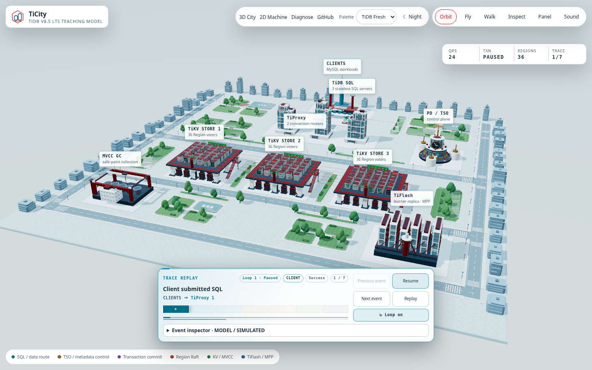
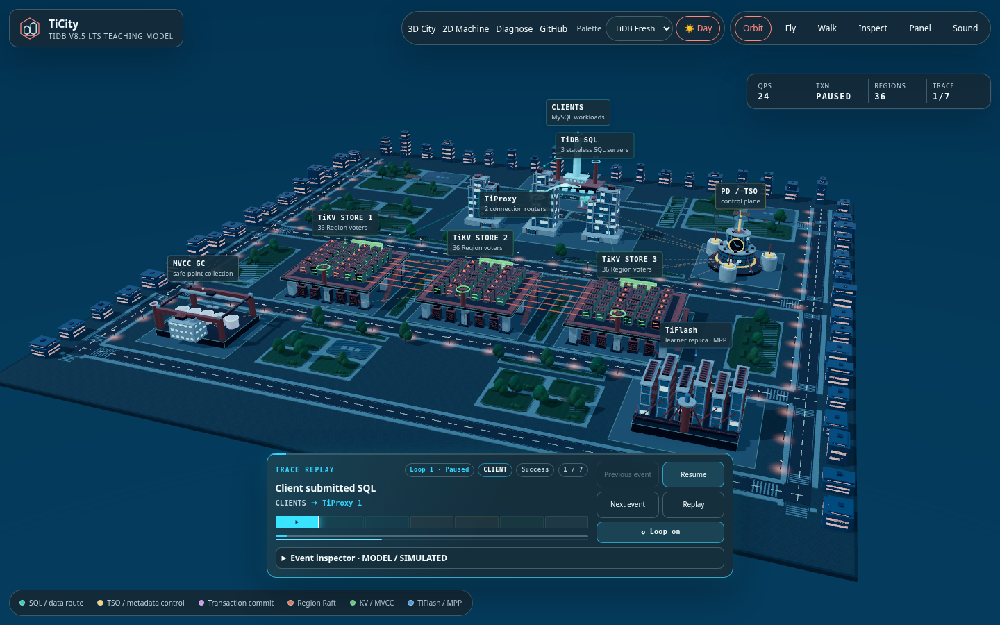
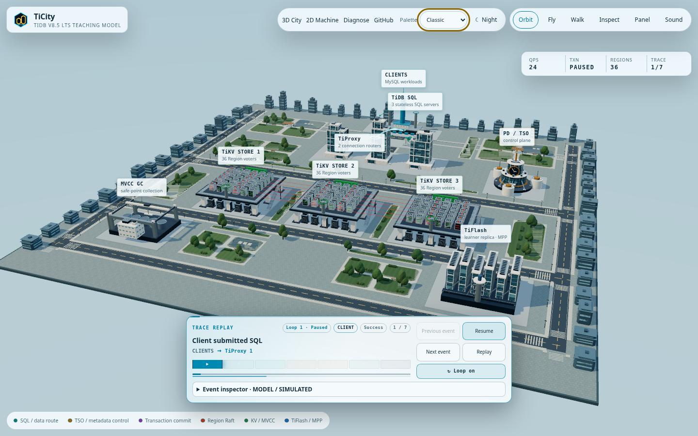
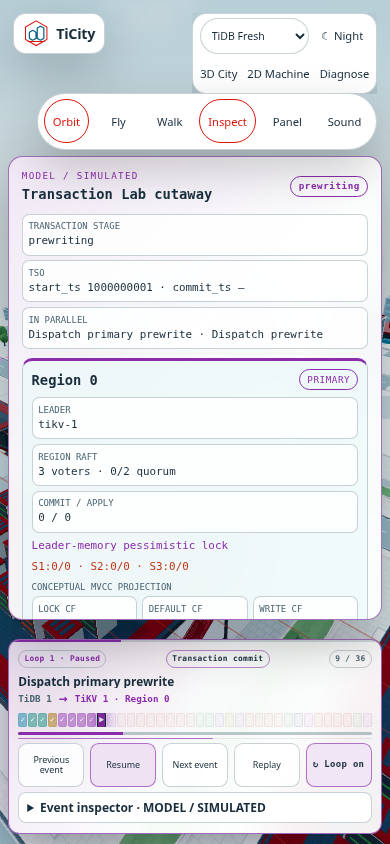

# TiDB Fresh and Classic

Use **Palette / 配色** in the top navigation to select **TiDB Fresh / TiDB
フレッシュ** or **Classic / クラシック**. TiDB Fresh is the default. The separate
day/night button works with either palette, on City, Machine and Diagnose.

TiDB Fresh uses white architecture, pale aqua/mint landscaping, cool glass and
TiDB's red accent. Classic retains the previous architectural and UI colours.
Switching changes existing materials, lights and CSS variables in place; it
does not restart the City, create a WebGL context, change an active receipt or
reset the model. SQL, timestamps, transaction 2PC, Region Raft, KV and TiFlash
retain their distinct semantic colours. The model remains
`tidb-v8.5-model-9`.









## Remembering and sharing a choice

The palette is saved as `ticity:appearance`; day/night is saved separately as
`ticity:theme`. These values contain only visual preferences. Neither contains
SQL or model input. Controls continue to work when storage reads or writes are
unavailable.

An explicit URL setting takes precedence over the saved preference:

- [TiDB Fresh, day](https://penguin425.github.io/TiCity/?appearance=tidb&theme=day)
- [Classic, day](https://penguin425.github.io/TiCity/?appearance=classic&theme=day)
- [TiDB Fresh, night](https://penguin425.github.io/TiCity/?appearance=tidb&theme=night)
- [Classic, night](https://penguin425.github.io/TiCity/?appearance=classic&theme=night)

Changing a choice updates that setting when it is already present in the URL,
so reloading a shared view preserves the user's latest choice. Navigation links
carry both settings, locale and the model's scenario/event identifiers. The
selector remains mounted while trace navigation updates links, retaining
keyboard focus. Mobile navigation keeps the palette and day/night controls
visible above the destination links.

## Primary colour sources

The TiDB product logo and documentation theme agree on **#DC150B**
(RGB 220, 21, 11). The sources below are pinned to the official
`pingcap/website-docs` commit
`c3c00ed180ccce17d47bc6233b8744bb59568b33`:

- [TiDB logo SVG](https://github.com/pingcap/website-docs/blob/c3c00ed180ccce17d47bc6233b8744bb59568b33/src/media/logo/tidb-logo-withtext.svg)
- [Official colour variables](https://github.com/pingcap/website-docs/blob/c3c00ed180ccce17d47bc6233b8744bb59568b33/src/theme/variables.css)

The surrounding palette draws on white/carbon (`#FFFFFF`, `#F9FAFB`), pale
peacock (`#EAF5FA`, `#C0E1F1`) and pale aqua (`#ECF9F9`, `#C6ECEC`). Paint,
lighting and landscaping are TiCity's own visual interpretation; this is an
independent educational project, not an official TiDB product.

Broad pale colours belong to scenery and decorative backgrounds. Fresh's
daytime text panels are white, keeping the existing semantic text colours
readable. The red accent has a 5.05:1 contrast ratio against white; dark blue
`#0B628D` has 6.68:1. Night uses a lighter coral accent against navy panels.

## Reproducing captures

With the local production preview running:

```bash
npm run capture:graphics -- --appearance tidb --output artifacts/fresh
npm run capture:graphics -- --appearance classic --output artifacts/classic
```

The appearance browser tests compare the two palettes, preserve real resource
and receipt references across switches, exercise selection/reload/navigation,
and check mobile navigation and Fresh day/night accessibility. Screenshot
readback pauses rendering only after settled frames; quality and simulation
settings remain intact.
