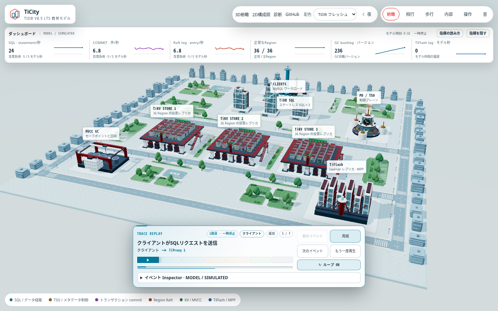
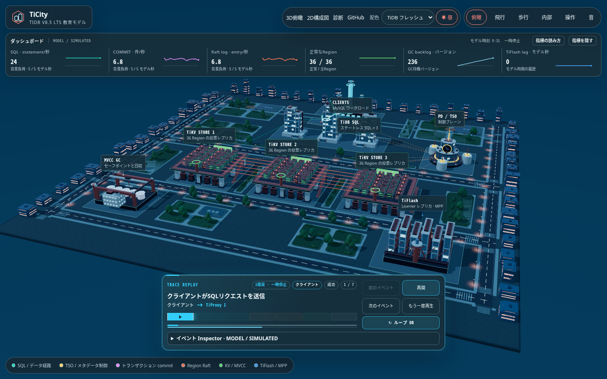
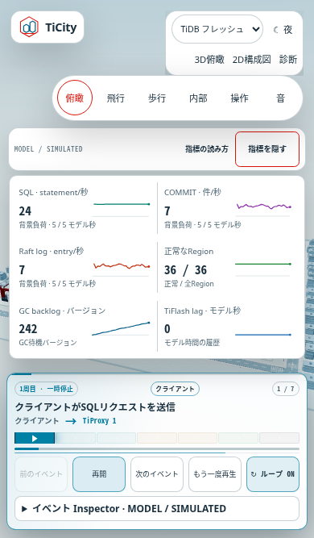

# City dashboard / モデルダッシュボード

City画面の上部で、6つの指標と小さな履歴グラフを確認できます。
PCでは初期表示、幅または高さが700px以下では折りたたみ表示です。
選んだ表示状態をブラウザーに保存し、次回も引き継ぎます。保存が制限された
ブラウザーでも、そのページでは表示を切り替えられます。
**指標を表示 / 指標を隠す**で開閉し、**指標の読み方**で各値の意味を確認できます。
キーボードではTabで操作を選び、EnterまたはSpaceで指標を開閉します。
TiDBフレッシュ／クラシックと昼／夜のすべての組み合わせに対応します。

The City view shows six metrics with compact history charts near the top.
Metrics start expanded on desktop and collapsed when width or height is
700px or less. An explicit visibility choice is saved for the next visit;
controls still work when preference storage is restricted.
Use **Show metrics / Hide metrics** to toggle them and **About these metrics**
to read their definitions. Use Tab to reach the toggle, then Enter or Space to
activate it. Both palettes and day/night themes are supported.

## Reading the six metrics / 6つの指標の意味

Every value is visibly labelled **MODEL / SIMULATED**. These are read-only
projections of TiCity's educational state, not live-cluster measurements or
benchmark results. Opening or closing the dashboard does not alter the model,
receipt, trace playback or renderer. The model remains `tidb-v8.5-model-9`.

すべての値は **MODEL / SIMULATED** として表示します。学習用モデルの状態を
読み取った値であり、実クラスタの監視値やベンチマークではありません。
ダッシュボードの開閉ではモデル、receipt、trace再生、rendererを変更しません。
モデルのバージョンは `tidb-v8.5-model-9` のままです。

| Metric / 指標 | Meaning / 意味 |
| --- | --- |
| SQL · statements/s / statement/秒 | Background statement-counter growth divided by observed model seconds; distinct from configured QPS. 背景負荷のstatement増分を観測モデル時間で割った値。設定QPSとは別です。 |
| COMMIT · commits/s / 件/秒 | Background committed-write-counter growth divided by observed model seconds; reads and Raft commits are separate. 背景負荷のwrite transactionのcommit増分。readやRaft commitとは別です。 |
| Raft log · entries/s / entry/秒 | Background Raft-entry-counter growth divided by observed model seconds; no WAL byte count is inferred. 背景負荷のRaft log entry増分。WALのバイト量には換算しません。 |
| Healthy Regions / 正常なRegion | Current healthy Region count / total Region count. Degraded and unavailable Regions are excluded from the numerator. 現在の正常Region数 / 全Region数。degradedとunavailableは正常数に含めません。 |
| GC backlog · versions / バージョン | Current `gc.backlog` version count. It is not PostgreSQL dirty buffers, disk bytes or every pending storage-maintenance operation. 現在のGC待機version数。PostgreSQLのdirty buffer、disk byte量、storage保守処理全体の待機数とは別です。 |
| TiFlash lag · model s / モデル秒 | Current `tiflash.lagSeconds`, or **—** when TiFlash is unavailable. TiFlash is a learner; this value does not describe TiKV voter quorum or readiness for a particular snapshot. 現在のTiFlashモデル遅延。未利用時は **—**。TiKV voterのquorumや特定snapshotのread readinessを表す値ではありません。 |

The first three values use counter differences over **up to five observed model
seconds**, with the actual interval shown beneath each value. A synchronous
SQL/trace request changes model counters without advancing model time; its
immediate counter jump is excluded from these background-load rates. The
resulting current gauges can still change. There is no latency, P50/P99 or WAL
metric: the existing receipt times use a stretched teaching clock, and the
model does not provide a workload-latency distribution or WAL byte stream.

最初の3指標は**直近最大5観測モデル秒**のcounter差分から計算し、実際に使った
時間幅を各値の下に表示します。SQL／traceの即時実行はモデル時刻を進めずに
counterを変更するため、その増分を背景負荷の速度から除外します。ただし、
実行結果によって現在のRegion、GC、TiFlashの状態は変わり得ます。
receiptの時刻は教育用に引き延ばした時計で、負荷全体のlatency分布や
WALバイト列もモデルにはないため、latency、P50/P99、WALは表示しません。

## History, pause and reset / 履歴・一時停止・リセット

History uses model time, not elapsed browser time. Each integer model-second
bucket retains only its first actual observation, at that observation's exact
time. At most 60 points from the latest 60 model-second buckets are retained.
The horizontal position follows the observation time; the Region chart shows
the healthy count, while its numeric value also shows the current total.

Missing observations are not backfilled or interpolated into synthetic samples.
After a gap longer than the rate window, rates show **— / Collecting** until a
new observed interval is available. Pausing stops model time and chart history;
the last background rates remain visible. Explicit SQL can still change current
gauges while paused. Selecting a scenario or resetting clears the history and
starts a fresh rate window. Hiding the metrics preserves their history during
the current page visit; reloading starts new observations.

履歴にはブラウザーの経過時間ではなくモデル時刻を使います。整数モデル秒の
区間ごとに最初の実観測だけを、その正確な時刻で記録します。保持するのは
直近60モデル秒区間の最大60点です。グラフの横位置は実観測の時刻に対応し、
Regionのグラフは正常数、数値表示は正常数と現在の全数を表します。

観測していない区間の点を補完・捏造しません。速度の集計幅より長い観測の
空白があると、新しい観測間隔が得られるまで速度は **— / 集計中**になります。
一時停止中はモデル時刻とグラフ履歴が止まり、最後の背景負荷の速度を表示します。
停止中も明示的なSQL実行で現在の状態は変わり得ます。シナリオ選択とリセットでは
履歴を消去して集計を始め直します。指標を隠しても同じページ滞在中の履歴は保持し、
再読み込みでは新しく観測を始めます。

## PGSimCity reference / 参考にしたPGSimCity

The compact instrument-strip layout is inspired by the original PGSimCity,
pinned to commit `2715ad63bd88b6c13cecc5d968a1c94dda975248`:

- [Five vital signs and their definitions](https://github.com/NikolayS/PGSimCity/blob/2715ad63bd88b6c13cecc5d968a1c94dda975248/src/ui/hud.ts#L92)
- [Metric tiles and 88 × 24 sparklines](https://github.com/NikolayS/PGSimCity/blob/2715ad63bd88b6c13cecc5d968a1c94dda975248/src/ui/hud.ts#L391)
- [Separate controls and metric rows](https://github.com/NikolayS/PGSimCity/blob/2715ad63bd88b6c13cecc5d968a1c94dda975248/src/styles/hud.css#L28)

TiCity adopts the readable arrangement, with metric meanings drawn from its
own TiDB educational model. PGSimCity's PostgreSQL WAL, dirty-buffer and
latency metrics are not transferred into TiCity. Upstream attribution and the
fork's derivation baseline remain recorded in [NOTICE](../NOTICE).

コンパクトな計器列の配置をPGSimCityから参考にし、指標の意味はTiCity自身の
TiDB学習用モデルに合わせています。PostgreSQLのWAL、dirty buffer、latencyの
指標を転用したものではありません。派生元の帰属とforkの基準commitは
[NOTICE](../NOTICE)に記録しています。
