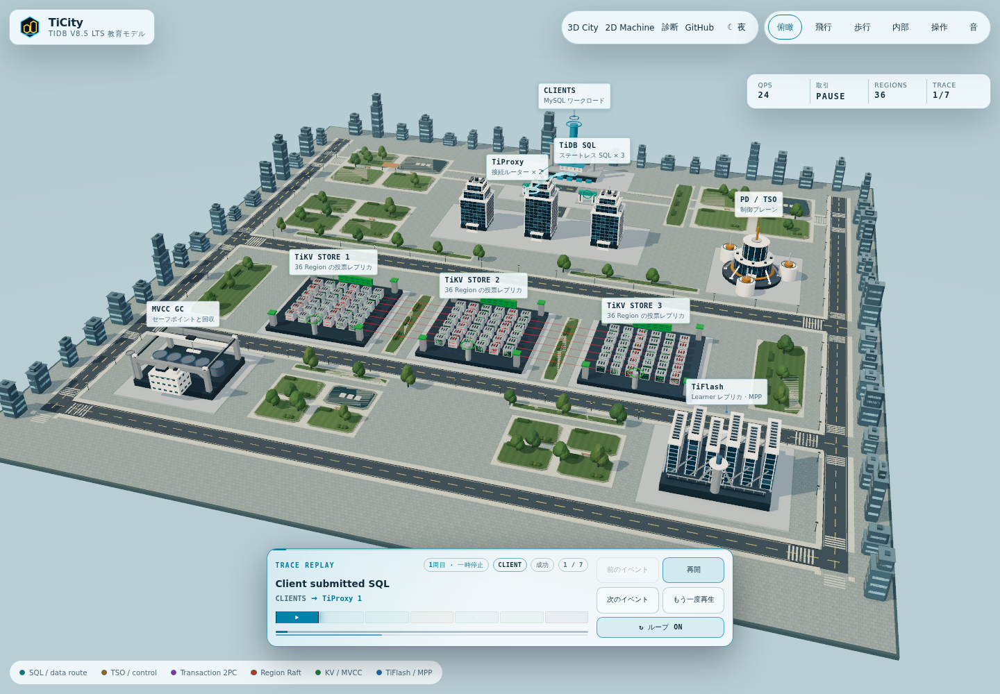
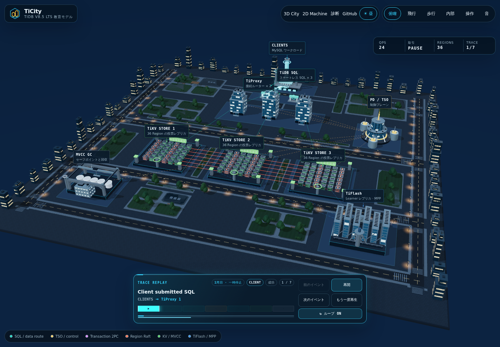
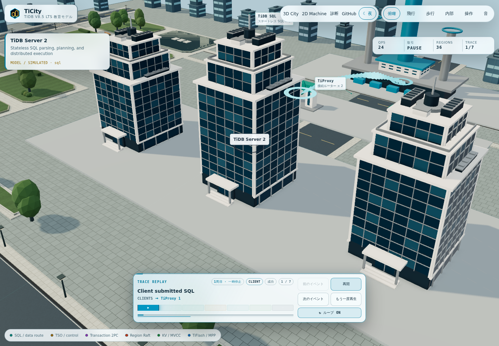
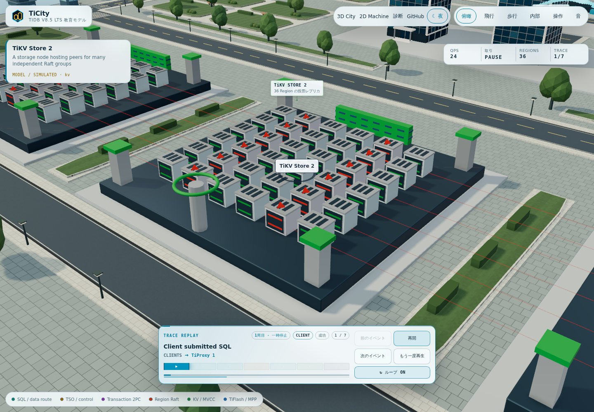
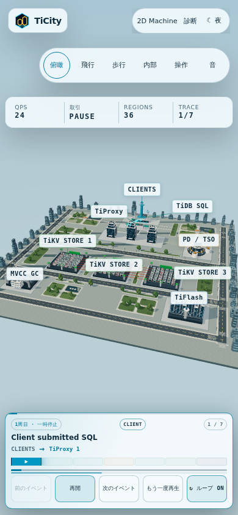

# Campus graphics

The campus uses procedural geometry and deterministic, locally generated surface
maps. There are no external image, font, HDR, analytics or cluster requests.
The educational scene follows the model's topology and keeps architectural
details separate from the state-driven database explanation.

## Educational campus





## What changed

The earlier Region racks were mostly buried in their decks and rendered black.
The deck top, rack footing, roof and route ports now share authored height
constants. Instanced colours no longer depend on a missing vertex-colour
attribute. That same material defect is also fixed in Transaction and Lock Labs.
Roof triangles identify leaders and crosses identify unavailable voters, while
status strips retain the separate Raft/KV semantic colours. Hotspot height,
roof details and selection anchors move together without sinking the footing.

SQL towers have dense curtain-wall bays, inset spandrels, slim mullions, stepped
cornices and roof machinery. A fixed subset of windows lights up at night rather
than making the entire facade emissive. Ivory concrete, charcoal metal, reflective
teal glass and brushed trim have distinct surface responses. Large masses and
rack cabinets use dimension-aware bevels, so edges catch highlights without
stretching the corner radius along a tall tower.

PD has a ribbed glass drum and layered terraces; TiFlash has framed glass ends,
metal louvers, service rails and roof plant. Rack doors, bezels and roof vents
remain aligned with the state-driven enclosures. These fittings are instanced,
not separate objects per window or rack.



The [2× nighttime close-up](graphics/architecture-night-2x.png) was captured at a
1200 × 800 CSS viewport with a verified 2400 × 1600 rendering buffer. Resizing
that same session to compact and back also verified the 1.25×/2× pixel-ratio and
2048px/4096px shadow transitions without runtime errors.

World-scale stone paving, asphalt grain and turf replace the ground grid.
Raised planting islands, multilobed trees, hedges, timber benches/pergolas and
still reflecting basins add scale. The perimeter skyline has chamfered towers,
setbacks, floor bands and equipment. All surface maps are generated locally.



The 38-degree architectural lens compresses perspective so rear buildings stay
readable; the camera backs away to retain the campus. Portrait widens the view and
opens with the control panel collapsed, leaving the canvas at full height.
District labels follow the current camera matrix, localize their descriptions,
and resolve small collisions near the building with short leader lines.



## Rendering boundaries

- `world/layout.ts`: authored geography and Region height constants.
- `world/geometry.ts`: shared primitives and static sibling batches that retain
  their selectable district parents, plus dimension-keyed beveled masses.
- `world/building-detail.ts`, `world/region-peers.ts`: architectural fittings and
  the state-driven rack projection.
- `world/environment-streets.ts`, `world/environment-skyline.ts`: instanced scenery.
- `world/environment-surfaces.ts`: deterministic texture maps and world-scale UVs.
- `engine/rendering.ts`: lighting, local reflection environment, cached shadows,
  multisampled desktop output, night bloom and resource disposal.
- `engine/ambient-occlusion.ts`: half-resolution contact shading reconstructed
  from the colour pass's depth, without drawing the campus a second time.
- `engine/lab-projections.ts`: exclusive projection of the six detailed labs.
- `engine/label-layout.ts`, `engine/label-copy.ts`: label layout and bilingual copy.

Reduced motion stops sky movement and keeps static trace presentation; it does
not remove the nighttime lighting. Desktop uses 4096px shadows, up to 2× pixel
ratio and contact shading in both themes. Compact displays use direct rendering,
2048px shadows and a 1.25× pixel-ratio cap. AO runs at half resolution while scene
colour remains full-size and multisampled. Diagram lines retain depth testing
but do not write depth, so faint topology does not become a solid AO occluder.
Renderer counters include the complete frame, including postprocessing.

At a 1440 × 1000 Chromium software-WebGL viewport, the reviewed daytime overview
used 159 draw calls, about 112,000 triangles and 58 uploaded geometries. The
preceding polish used 168 calls, about 60,000 triangles and 49 geometries; the
original overview used 225 calls, about 45,000 triangles and 182 geometries.
These are scene counters, not an FPS benchmark; camera framing, shadow updates,
driver and selected lab affect the values. More visible detail increases triangle
count while shared primitives and instancing reduce calls and buffers.

The complete educational campus, including hidden labs, remains within 270 drawables,
225 unique geometries and 55 shadow casters. The material ceiling is 72 to
accommodate the separate instanced status lights and architectural glass.
The reviewed overview's steady-frame triangle ceiling is deliberately increased
from 80,000 to 140,000 for real bevels, facade bays and layered vegetation. Live
frames that refresh the shadow map have a separate 180,000 ceiling (the reviewed
refresh used 194 calls and about 149,000 triangles); the 280-call ceiling remains
unchanged. Pixel fill cost also increases at desktop high DPI:
these improvements trade some GPU work for visibly finer surfaces and shading,
not a claim of faster frame rates.
These budgets and frame counters are not an FPS claim. Tests additionally cover
the campus geometry, local texture generation, picking boundaries and camera
transitions.

Regression checks cover missing vertex colours, fixed rack footing, moving
selection anchors, borrowed depth-buffer swaps, exactly-once disposal, reduced motion, portrait controls,
offline operation and the existing model/cross-view invariants.

## Reproduce the views

With the built preview running:

```bash
npm run build
npm run preview
```

In another terminal:

```bash
npm run capture:graphics
npm run capture:graphics -- --labs
npm run capture:graphics -- --base-url https://penguin425.github.io/TiCity/
```

Captures include campus day/night/detail/mobile and go to the ignored
`artifacts/graphics/` directory. Use `--base-url` to
select a server and `--output` to select another destination. The lab set uses
fixed event IDs for primary commit, deadlock, election, Async Commit response,
GC compaction and learner apply. The script freezes each settled frame during
capture, then resumes rendering, and fails on runtime or WebGL errors.

The visual inspiration remains PGSimCity's layered building silhouettes and
machinery. Attribution and the upstream base commit remain in [NOTICE](../NOTICE).
